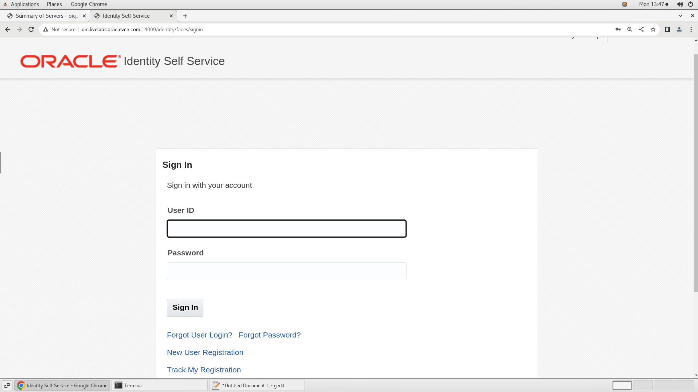
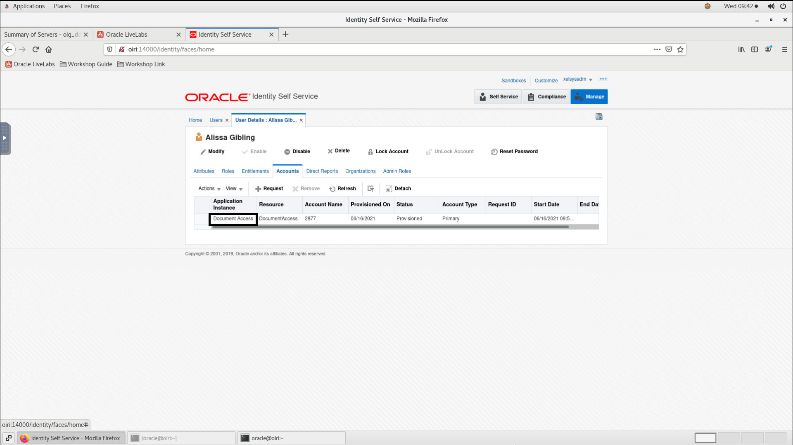

# Deploy Kubernetes Cluster And Start OIG Server

## Introduction

In this lab we will review and start all and deploy Kubernetes nodes required to successfully run this workshop.

*Estimated Lab Time*: 20 minutes

### Objectives

In this lab, you will:
* Create and Initialize Kubernetes Cluster
* Start the OIG 12c domain. Analyze different roles and entitlements created in OIG

### Prerequisites
This lab assumes you have:
- A Free Tier, Paid or LiveLabs Oracle Cloud account
- You have completed:
    - Lab: Prepare Setup (*Free-tier* and *Paid Tenants* only)
    - Lab: Environment Setup
    - Lab: Initialize Environment


## Task 1: Initialize the Kubernetes cluster and the pod network add-on

1. Open a terminal session.

    ```
    <copy>sudo swapoff -a</copy>
    ```
    ```
    <copy>sudo setenforce 0</copy>
    ```
    ```
    <copy>sudo sed -i --follow-symlinks 's/SELINUX=enforcing/SELINUX=disabled/g' /etc/sysconfig/selinux</copy>
    ```

2. Deploy and initialize the pod network and make sure that the pod network does not overlap with any of the host networks.

    ```
    <copy>sudo kubeadm init --pod-network-cidr=10.244.0.0/16</copy>
    ```

3. Enable kubectl to work with non-root users.

    ```
    <copy>sudo cp -i /etc/kubernetes/admin.conf /home/oracle/.kube/config</copy>
    ```
    ```
    <copy>sudo chown oracle:oinstall /home/oracle/.kube/config</copy>
    ```

4. Launch another terminal session and schedule Pods on the control-plane node.

    ```
    <copy>kubectl taint nodes --all node-role.kubernetes.io/master-</copy>
    ```

5. List all pods in all namespaces.

    ```
    <copy>kubectl get pods --all-namespaces</copy>
    ```

6. Update the resources in the cluster and make sure all pods are in the “Running” state.

    ```
    <copy>kubectl apply -f https://raw.githubusercontent.com/coreos/flannel/master/Documentation/kube-flannel.yml</copy>
    ```
    Wait for 1-2 minutes and list all the pods and make sure they are in the *Running* and *READY 1/1* state.

    ```
    <copy>kubectl get pods --all-namespaces</copy>
    ```

    

## Task 2: Start the Oracle Identity Governance (OIG) Server and analyze the roles in OIG

<!-- 1. Verify that the OIG Database is running.

    ```
    <copy>systemctl status oracle-database.service</copy>
    ```

     -->

1. Verify that the Admin Server is running. Open a browser window and use the below mentioned URL to access the Weblogic console.
     
    ```
    URL  http://oiri.livelabs.oraclevcn.com:7001/console/login/
    ```

    

2. Sign in to the console with the weblogic credentials.

    ```
    Username  weblogic
    Password  Welcome1
    ```

    

3. On the Weblogic console, Click on *Servers* under *Environment*. Under Summary of servers, click on *Control*.

    

    Select SOA and OIM server and click on *Start*.

    
    

4. Open another browser tab and use the below URL to access the *OIG Identity Console*. Login to the Identity console using the following credentials:


    ```
    URL       http://oiri.livelabs.oraclevcn.com:14000/identity
    Username  xelsysadm
    Password  Welcome1
    ```


    

    

5. Click on *Manage* on the top right corner. Then, click on *Users* and notice that about 1000 test users have been created with respective roles and entitlements. Click on any user and Click on the *Accounts* tab notice that the users are provisioned to the *Document Access* application.

    

    

    

    


6. Now click on *Home*. Then, click on *Roles and Access policies* and select *Roles*. Notice that the *OrclOIRIRoleEngineer* role is created and assigned to the application user so that the user can login to the OIRI application. Click on the *OrclOIRIRoleEngineer* role. Click on the *Members* tab and notice that this role is assigned to the *xelsysadm* user.

    

    

    

You may now [proceed to the next lab](#next).

## Acknowledgements
* **Author** - Keerti R, Brijith TG, Anuj Tripathi, NATD Solution Engineering
* **Contributors** -  Keerti R, Brijith TG, Anuj Tripathi
* **Last Updated By/Date** - Indiradarshni B, NATD Solution Engineering, December 2022
