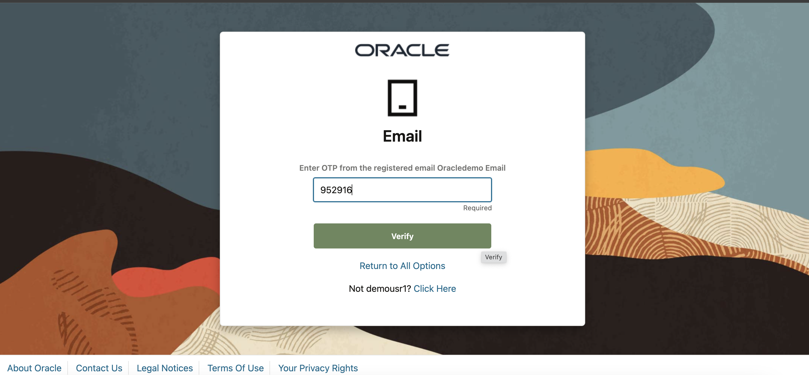
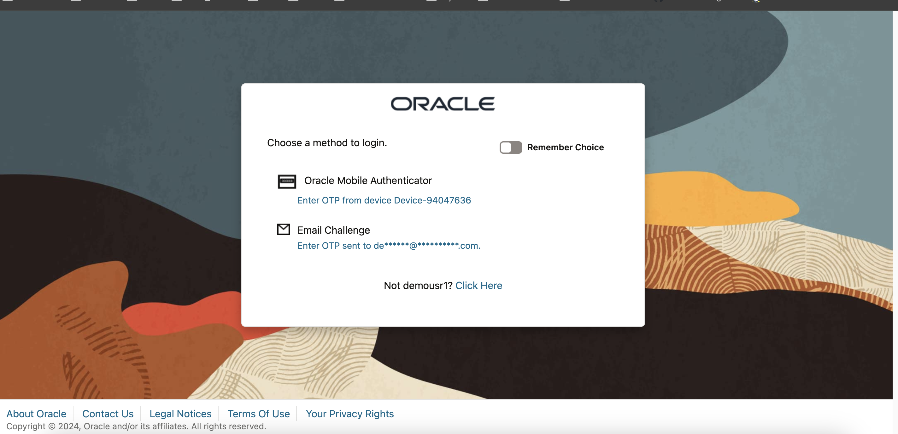
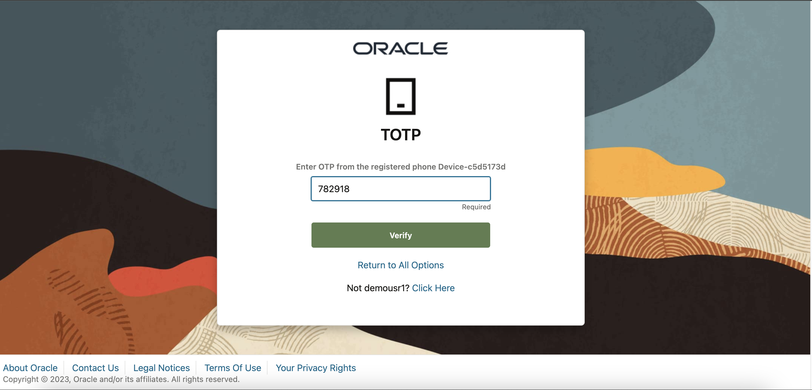

# Authenticate using Oracle Advanced Authentication

## Introduction

Oracle Advanced Authentication (OAA) is a standalone micro-service that supports establishing and asserting the identity of users. It provides a comprehensive solution that is simple to deploy and use.OAA provides strong authentication using Multiple Authentication Factors (MFA). A wide range of authentication (challenge) factors are available out-of-the-box for establishing the identity of users.

It supports integration with Oracle Access Management (OAM) and Oracle RADIUS Agent (ORA) to provide MFA capabilities. It also can be used with Oracle Universal Authenticator for device authentication with MFA.

This lab walks you through a sample web application using multi-factor authentication based on email and OMA app based OTPs.

* Estimated Time: 30 minutes
* Persona: End-User

### Objectives

In this lab, you will:

* Access the sample web application using Oracle Advanced Authentication

  ***Note:*** All the demo users and apps have been pre-seeded to perform the use-cases

### Prerequisites

This lab assumes you have:

* Oracle Mobile Authenticator installed in your mobile device. Follow the respective link below to install the application :

     [OMA on Google Store](https://play.google.com/store/apps/details?id=oracle.idm.mobile.authenticator&hl=en_CA&gl=US)

     [OMA on Apple Store](https://apps.apple.com/us/app/oracle-mobile-authenticator/id835904829)

* A test account registered in OMA. Use the following instructions to do that :

    1. Open OMA in your mobile device

    2. If this is the first time accessing OMA, click on Add Account, otherwise tap the plus (+) icon at the bottom of the screen

    3. Then tap on **Enter key manually** link

    4. In Select Account Type, choose Oracle. Then, enter the following information:

      Company : **Oracle** 

      Account

        ```
        <copy>
        Demo User1
        </copy>
        ```

      Key

        ```
        <copy>
        DemoAppUsrOne
        </copy>
        ```

    5. Tap on Save button to register the account.

## Task 1: Authenticate into sample web app using Email OTP

1. Open your preferred browser. Access the **Email Client** using below details. This would be used to receive OTPs :

   ***Note :*** You might notice a certificate related warning saying 'Your connection is not private'. You can click **Advanced** and **Proceed to mail.oracledemo.com.**

  Mailu Email Console:
    ```
    <copy>
    https://mail.oracledemo.com/
    </copy>
    ```

  User
    ```
    <copy>
    demousr1@oracledemo.com
    </copy>
    ```

  Password
    ```
    <copy>
    Oracle123
    </copy>
    ```

  Choose **Sign in Webmail**.

2. Open a new browser tab. Access the sample web app using below details and Click Login :

  Sample Web App:
    ```
    <copy>
    http://ade.oracledemo.com/demoapp/index.html
    </copy>
    ```

  User
    ```
    <copy>
    demousr1
    </copy>
    ```

  Password
    ```
    <copy>
    Oracle123
    </copy>
    ```
3. Click on the link below **Email Challenge** to receive email OTP as the second factor. In case you see multiple options under **Email Challenge**, choose the one that says **Enter OTP sent to ***de\*\*\*\*@\*\*\*\*\*.com***** :

  ***Note :Since this is a fresh deployment so you might see a message*** **Processing Request ....** ***displayed in the browser for a minute or so before being prompted to choose MFA options.***

   

4. Goto the email client to receive the newly delivered OTPs. ***This might take around 30 secs to a minute for OTP to get delivered.*** You could try refreshing the mailbox by clicking on **Refresh** button or reloading the browser page itself.

5. Provide the OTP in the login flow. Click Verify.

   

6. You should be redirected to the sample app landing page after successful authentication.

  ***Note :*** At this point, you should sign out from the application and close the browser tab as you would be authenticating again with a different MFA factor.

## Task 2: Authenticate into sample web app using OTP from OMA app

1. In a new browser window, access the sample web app as described in **Task 1: Step 2**.

2. Click on the link below **Oracle Mobile Authenticator**.

   

3. Open OMA app in yur phone and note the OTP for account **Demo User1**. Provide the OTP in the login flow and Click Verify

   

4. You should be redirected to the sample app landing page after successful authentication.

  You may now **proceed to the next lab**.

## Learn More

* [Oracle Universal Authenticator Product Documentation](https://docs.oracle.com/en/middleware/idm/universal-authenticator/)

* [Oracle Universal Authenticator System Architecture](https://docs.oracle.com/en/middleware/idm/universal-authenticator/ouaad/system-architecture-and-components.html)

* [Oracle Advanced Authentication](https://docs.oracle.com/en/middleware/idm/advanced-authentication/oaarm/introducing-oaa.html)

## Acknowledgements

* **Created By/Date** - Anuj Tripathi, North America Platform Specialist (IAM/Cloud), July 2024

* **Last Updated By** - Anuj Tripathi, Aug 2024
