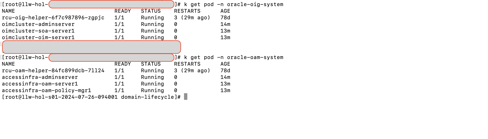

# Start the environment

## Introduction

This lab walks through steps on starting and configuring the components including IAM domains and services.

* Estimated Time: 30 minutes
* Persona: OCI Administrator

### Objectives

In this lab, you will:

* Start the components deployed in the previous lab

### Prerequisites

This lab assumes you have:

* You have performed the previous lab and were able to deploy the stack successfully

## Task 1: Update your Host file

1. Login to the OCI console Identity Domain: Choose the right domain and login as the **Identity Domain Administrator**

2. In the OCI console, click the Navigation Menu icon in the top left corner to display the Navigation menu. Under Compute, Click Instances. Select the correct compartment to display the compute instance that was deployed as part of **Lab1**.
  Note the public IP of the compute VM.

3. Open a text editor in your computer in the **Administrator mode** to add following entries in the hosts file.

   ***Note :*** In case of Windows, the location is **C:\Windows\System32\drivers\etc\hosts**. In case of Mac, the location is **\etc\hosts**.

   ***Note :*** Replace **PUBLIC_IP** with the IP of compute instance noted in previous step.

    ```
    <copy>
    <PUBLIC_IP>    so92-srv1.oracledemo.com iamdb.oracledemo.com oud.oracledemo.com oam.oracledemo.com aso.oracledemo.com oaa.oracledemo.com ora.oracledemo.com oim.oracledemo.com mail.oracledemo.com
    <PUBLIC_IP>    oiri.oracledemo.com grafana.oracledemo.com prometheus.oracledemo.com oap.oracledemo.com oudsm.oracledemo.com ade.oracledemo.com demodb.oracledemo.com
    </copy>
    ```

## Task 2: Start IAM Domains and Services

1. Start the IAM Domains and Services.
  Using an SSH client and the SSH private key, connect as opc user to the compute instance so92-srv1.
  Replace **PATH\_OF\_SSH\_PRIVATE\_KEY** with ssh private key referred in **Lab1 > Task 3 > Step 6**.
  Also, replace **PUBLIC\_IP** with public IP of the VM noted previously.

    ```
    <copy>
    ssh -i <path_of_ssh_private_key> opc@<PUBLIC_IP>
    </copy>
    ```

  Then, switch to root user by running the following command.

    ```
    <copy>
    sudo su - || (sudo sed -i -e 's|root:x:0:0:root:/root:.*$|root:x:0:0:root:/root:/bin/bash|g' /etc/passwd && sudo su -)
    </copy>
    ```

  ***Note 1:*** For most of the time, you will use the root user to manage the IAM components and the Kubernetes cluster using Kubectl.

  ***Note 2:*** To connect directly via SSH using the root user, as root user copy the opc's SSH authorization key (/home/opc/.ssh/authorized\_keys) to the root's authorization file (/root/.ssh/authorized\_keys).

2. As root user run the following commands to check the context and status of the SecureOracle Kubernetes cluster.
  E.g. run the following command to get the current context:

    ```
    <copy>
    k config get-contexts
    </copy>
    ```

  The output should be similar to the following:

    ```
    CURRENT   NAME      CLUSTER   AUTHINFO   NAMESPACE

    *     default   default   default
    ```

3. Run the following command to check the status of cluster nodes:

    ```
    <copy>
    k get nodes
    </copy>
    ```

  The output should be similar to the following:

    ```
    NAME                       STATUS   ROLES                  AGE   VERSION
    so92-srv1.oracledemo.com   Ready    control-plane,master   20d   v1.21.12+k3s1
    ```
  The Oracle Database and Oracle REST Data Services (ORDS) start automatically, so before starting the OIG and OAM domains, check the status of the database pod.

4. Run the following command to check the status of the database pod:

    ```
    <copy>
    k get singleinstancedatabase oracle-iam-db -o "jsonpath={.status.status}" -n oracle-db-system
    </copy>
    ```

  The output should be similar to the following:

    ```
    Healthy
    ```

5. As root user start OIG and OAM domains.

    ```
    <copy>
    cd ~/domain-lifecycle
    </copy>
    ```

  Start OIG domain

    ```
    <copy>
    ./startDomain.sh -n oracle-oig-system -d oimcluster
    </copy>
    ```

  Start OAM domain

    ```
    <copy>
    ./startDomain.sh -n oracle-oam-system -d accessinfra
    </copy>
    ```

  ***Note :*** You can monitor the pods by running the following commands in a separate terminal (press CTRL+C to exit the watch command).

  Monitor OAM pods

    ```
    <copy>
    watch k get pods -n oracle-oam-system
    </copy>
    ```

  Monitor OIG pods

    ```
    <copy>
    watch k get pods -n oracle-oig-system
    </copy>
    ```

  ***Note : It would take around 20 mins for OIG and OAM pods to start. Make sure the all the pods are RUNNING with a READY 1/1 state***. Refer to below screenshot :

  

6. The Apache HTTP Servers start automatically, run the following command to check the status of the Apache instances.

    ```
    <copy>
    k get pod -n oracle-apache-system
    </copy>
    ```

  The output should be similar to the following:

    ```
    NAME                                         READY   STATUS    RESTARTS   AGE
    apacheweb-apache-webtier-5c948b9b44-qbdk7    1/1     Running   2          31d
    apacheproxy-apache-webtier-7cdcd4b76-zhmck   1/1     Running   0          3d15h
    ```

7. Update the config map in CoreDNS, so pods can resolve hostnames internally.
    E.g. as root user run the following command to get the server IP address:

    ```
    <copy>
    hostname -i
    </copy>
    ```

8. Edit the config map with the following command:

    ```
    <copy>
    kubectl edit cm coredns -n kube-system
    </copy>
    ```

  Press **i** to enter into insert mode. Replace in the following section the IP addresses with the one obtained from the previous command:

    ```
    ...
      NodeHosts: |
        10.2.1.168 oaa.oracledemo.com
        10.2.1.168 so92-srv1.oracledemo.com
        10.2.1.168 oim.oracledemo.com
        10.2.1.168 aso.oracledemo.com
        10.2.1.168 oam.oracledemo.com
        10.2.1.168 ora.oracledemo.com
        10.2.1.168 oud.oracledemo.com
        10.2.1.168 demodb.oracledemo.com
    ...
    ```
  Press **[esc]** key and type **:wq!** to save the changes

7. After the OAM domain is started, you must manually restart the fido, admin-ui, spui, kba pods for OAA/OARM. From server so92-srv1, you can use Kubectl to delete these pods which automatically restarts the pods.

  Run the following commands to get all the oaa pods and note the names for fido, admin-ui, spui and kba pod.

    ```
    <copy>
    k get pod -n oracle-oaa-system | grep "fido"
    </copy>
    ```
    ```
    <copy>
    k get pod -n oracle-oaa-system | grep "admin-ui"
    </copy>
    ```
    ```
    <copy>
    k get pod -n oracle-oaa-system | grep "spui"
    </copy>
    ```
    ```
    <copy>
    k get pod -n oracle-oaa-system | grep "kba"
    </copy>
    ```

  Replace the **pod-name** in the below command with the pod names returned from previous commands one at a time:

    ```
    k delete pod <pod_name> -n oracle-oaa-system
    ```

You may now **proceed to the next lab**.

## Learn More

* [Oracle Universal Authenticator Product Documentation](https://docs.oracle.com/en/middleware/idm/universal-authenticator/)

* [Oracle Universal Authenticator System Architecture](https://docs.oracle.com/en/middleware/idm/universal-authenticator/ouaad/system-architecture-and-components.html)

* [Oracle Advanced Authentication](https://docs.oracle.com/en/middleware/idm/advanced-authentication/oaarm/introducing-oaa.html)

## Acknowledgements

* **Created By/Date** - Anuj Tripathi, North America Platform Specialist (IAM/Cloud), July 2024

* **Last Updated By** - Anuj Tripathi, Aug 2024
