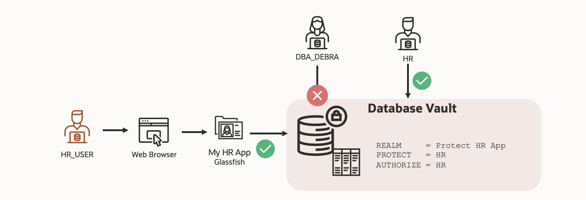

# Migrate a legacy Glassfish application to Oracle Autonomous Database using Oracle Database Vault

## Introduction

One of the primary challenges when moving to the cloud is how to integrate legacy enterprises applications and services into the modern, secure, cloud. Using the power of Oracle Database Vault and Autonomous DB, customers can have flexibility and peace of mind when it comes to moving their legacy services and applications to the cloud, with their data encrypted and secured at rest and in motion.

When you boil it down, the hostility towards moving to the cloud comes from three main reasons when it comes the realm of security:
- Losing control: When a system goes down, who is to blame?
- Data Protection: When moving to the cloud, how do I make sure my data is secure and encrypted?
- Security: Can other customers access our data? Have all the security patches been kept up to date?

Using Oracle Database Vault, customers can learn how to migrate their legacy applications to the cloud in a secure and flexible manner to the cloud.

Oracle Database Vault implements data security controls within Oracle Database to restrict access to application data by privileged users. Reduce the risk of insider and outside threats and address compliance requirements, including separation of duties.

Estimated Time: 90 minutes

### Objectives

In this lab, you will complete the following tasks:

- Connect to the Glassfish legacy HR application
- Configure the Autonomous Database Instance
- Load and verify the data in the Glassfish application
- Enable Database Vault and verify the HR application
- Identify the connections to the EMPLOYEESEARCH_PROD schema
- Explore the Glassfish HR application functions with Database Vault enabled

### Prerequisites

This lab assumes you have:
- An Oracle Always Free/Free Tier, Paid or LiveLabs Cloud Account
- Familiarity with Database is desired
- Some understanding of cloud and database terms is helpful
- Familiarity with Oracle Cloud Infrastructure (OCI) is helpful
- Some basic understanding of data protection and security is a plus
- Some familiarity with Linux/Bash commands is helpful

## Want to learn more about Oracle Database Vault?
- [Oracle Database Vault Landing Page](https://www.oracle.com/uk/security/database-security/database-vault/)
- [Introduction to Oracle Database Vault](https://docs.oracle.com/database/121/DVADM/dvintro.htm#DVADM001)
- [Additional Database Vault LiveLab](https://apexapps.oracle.com/pls/apex/r/dbpm/livelabs/view-workshop?wid=682&clear=RR,180&session=100352880546347)

## Acknowledgements

- **Author** - Ethan Shmargad, North America Specialists Hub
- **Creator** - Richard Evans, Senior Principle Product Manager
- **Last Updated By/Date** - Ethan Shmargad, September 2022
