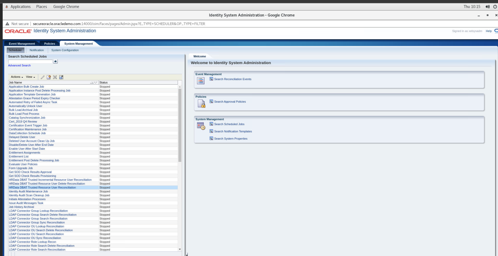
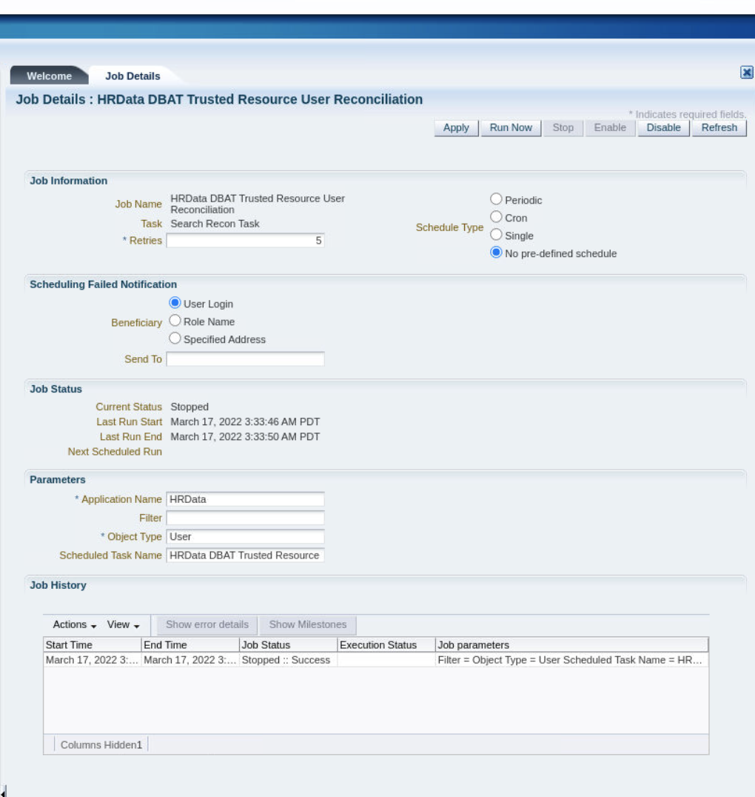
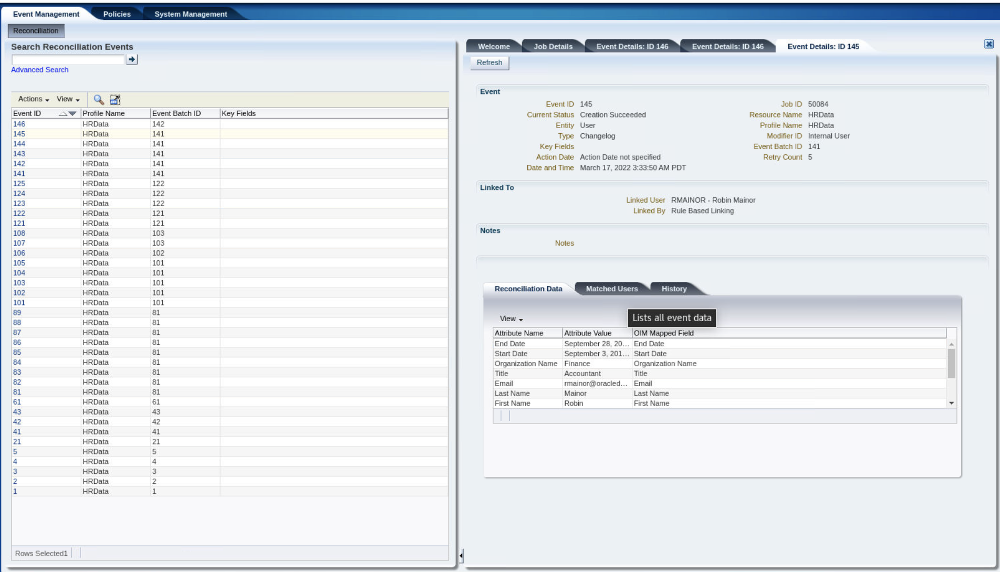
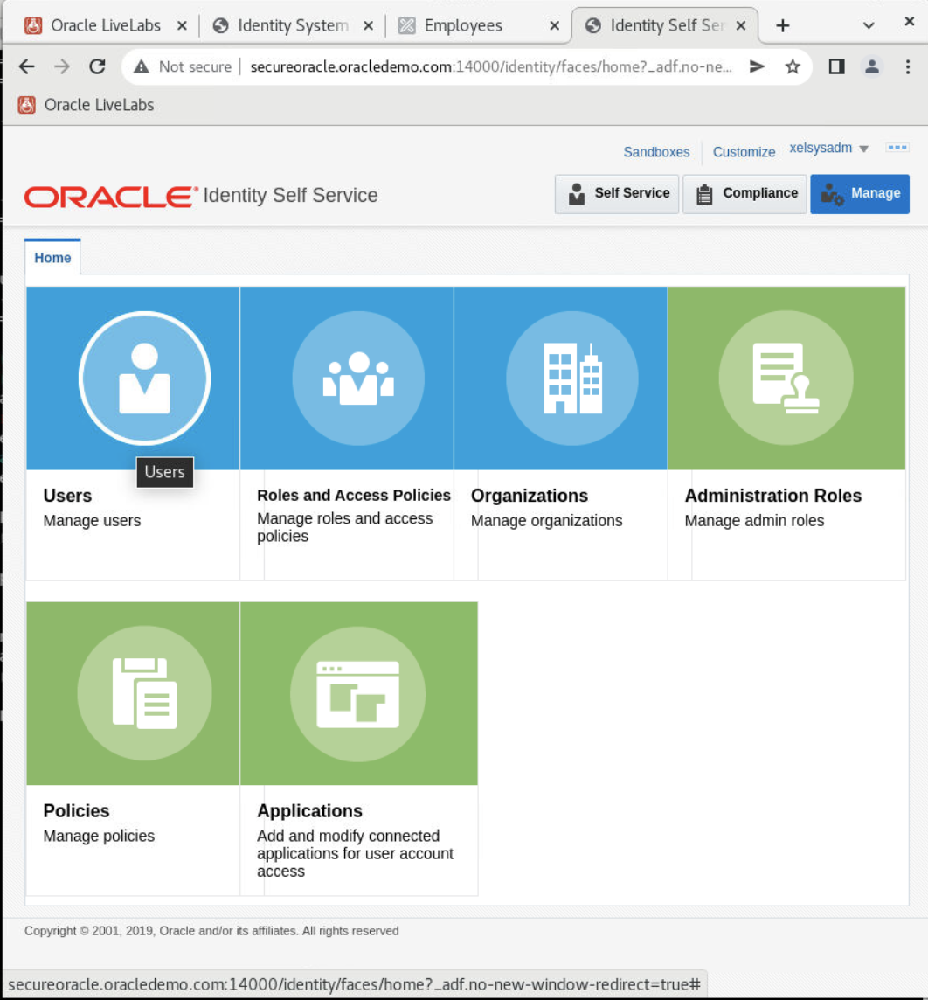
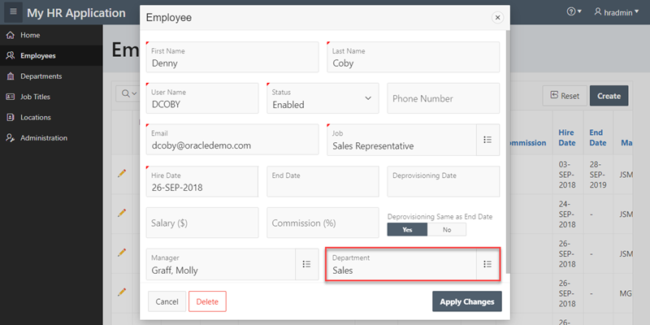
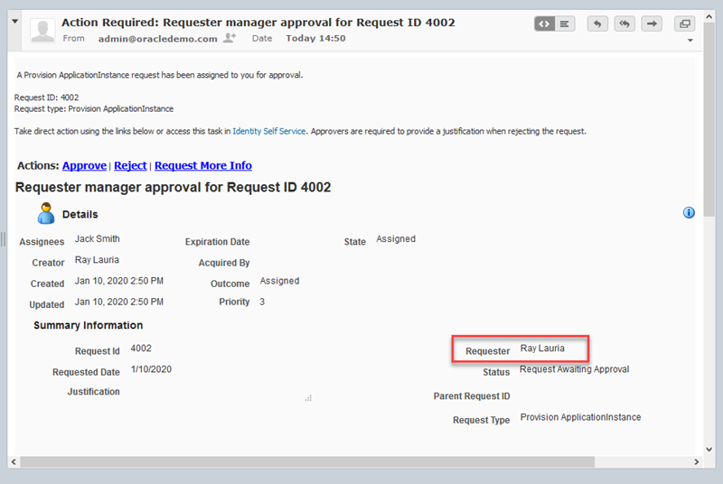
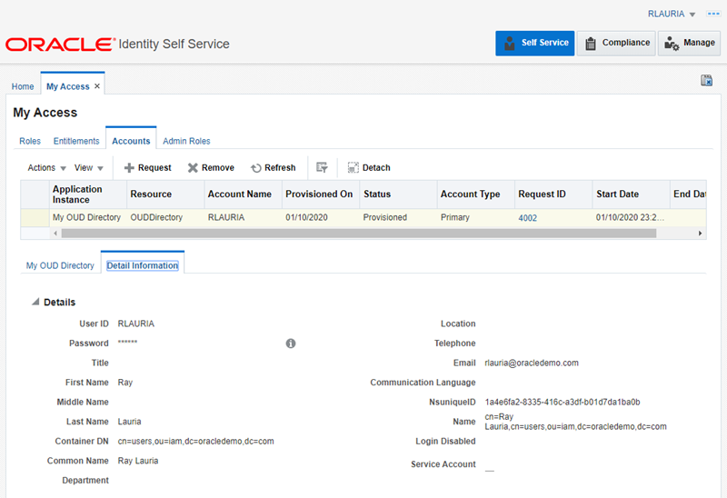

# Employee Lifecycle Management

## Introduction

In this lab we will exercise several use cases associated with employee on-boarding, user lifecycle, transfers, manager approvals and employee terminations using **My HR Application** as authoritative source in Oracle Identity Manager.

My HR Application is a sample application developed in Oracle APEX and hosted in the Oracle database. Its main function is to manage and store employee data in tables within the database HR schema. The Oracle Identity Manager **DBAT Connector** is used to interface with the database tables facilitating the on-boarding and management of employees records into Oracle Identity Manager.


Figure 1. My HR Application

The following use cases are available:

* Employee on-boarding and notifications
* Employee transfer and role updates
* Self service, access request, actionable notifications and approvals
* Employee termination

*Estimated Lab Time*:  60 minutes

### Objectives
- Become familiar with employee lifecycle management

### Prerequisites
This lab assumes you have:
- A Free Tier, Paid or LiveLabs Oracle Cloud account
- You have completed:
    - Lab: Prepare Setup (*Free-tier* and *Paid Tenants* only)
    - Lab: Environment Setup
    - Lab: Initialize Environment

## Task 1: Validate Access to required components and applications

1. Validate Access to required components and applications. Refer to *Lab 1: Initialize Environment* for more

    Oracle Identity Manager Admin Console:

    ```
    URL         http://secureoracle.oracledemo.com:14000/sysadmin
    User        xelsysadm
    Password    Oracle123
    ```

    Oracle Identity Manager Self Service:

    ```
    URL         http://secureoracle.oracledemo.com:14000/identity
    User        xelsysadm
    Password    Oracle123
    ```

    Email Web Client (Roundcube):

    ```
    URL         http://secureoracle.oracledemo.com/roundcubemail-1.4.1/
    User        admin
    Password    Oracle123
    Server      secureoracle.oracledemo.com
    ```

    Email Server Admin Console (Hedwig Mail Server):

    ```
    URL         http://secureoracle.oracledemo.com:7001/hedwig-web-0.6/
    User        admin
    Password    Oracle123
    ```

    APEX HR Workspace

    ```
    URL         http://secureoracle.oracledemo.com:7001/ords/
    Workspace   HRSPACE
    User        hradmin
    Pass        Oracle123
    ```

    My HR Application:

    ```
    URL         http://secureoracle.oracledemo.com:7001/ords/f?p=100
    User        hradmin
    Password    Oracle123
    ```

## Task 2: Employee On-Boarding and Notifications
1. Open the APEX Workspace **HRSPACE** in a browser and Proceed to import new employees into My HR Application.

    E.g. Use the following link and credentials:

    ```
    URL          http://secureoracle.oracledemo.com:7001/ords/
    Workspace    hrspace
    User         hradmin
    Password     Oracle123
    ```

2. In the APEX Workspace, click on **SQL Workshop** tile, then on **`Utilities -> Data Workshop`**. In the Data Workshop page, click on **Load Data**, then select **Choose File** and enter the location of file **`import-new-employees.csv`**.

    **Note**: file **`import-new-employees.csv`** can be copied from **`/home/oracle/demo/sample-data`**

3. Once the file is analyzed, the **Preview** section is displayed, click on the **Preview** button to see a full view of all columns and rows to be imported. Proceed to close the window.

4. Back in the Load Data page, enter the required information.

    E.g. Select or enter the following data:

    ```
    Load To        Existing Table
    Table Owner    HR
    Table Name     EMPLOYEES
    Update Method  Append
    ```

5. Click on **Load Data** button to start the import process. Upon successful import of new rows, proceed to close the Load Data page.

6. Sign out from APEX Workspace by clicking in the **HRADMIN** avatar in the top right corner and select **Sign out**.

7. Open another tab and Login as user **hradmin** with password **Oracle123** to My HR Application.

    E.g. use the following link and credentials:

    ```
    URL         http://secureoracle.oracledemo.com:7001/ords/f?p=100
    User        hradmin
    Password    Oracle123
    ```

8. Click on **Employees** tile to open the employees page and verify that employees in the table below have been added.

    E.g. the following new employees should be added after completing the previous import process:

    ```
    FULL NAME     USER ID   EMAIL                    DEARTMENT  TITLE       HIRE DATE    END DATE     MANAGER
    Denny Coby    DCOBY     dcoby@oracledemo.com     Sales      Sales Rep   26-Sep-2018               MGRAFF
    Gene Marton   GMARTON   gmarton@oracledemo.com   Finance    Accountant  26-Sep-2018               JSMITH
    Ray Lauria    RLAURIA   rlauria@oracledemo.com   Finance    Accountant  24-Sep-2018               JSMITH
    Robin Mainor  RMAINOR   rmainor@oracledemo.com   Finance    Accountant  03-Sep-2018  28-Sep-2019  JSMITH    
    ```

    **Note:** Email accounts for the above employees have been created already, so you don't need to create the email accounts. Unless instructed to do so, do not delete existing employees as this will result in terminating existing OIM users which are part of other use cases in the demonstration environment.

9. Optionally, you can manually create new employees by clicking on the **Create** button, however be aware that only employees belonging to **Finance** or **Sales** departments should be successfully imported via the reconciliation task in OIM.

    E.g. you must provide at least the following data to create a new employee:

    ```
    FIRST NAME, LAST NAME, USER NAME, STATUS, EMAIL, JOB, HIRE DATE, DEPARTMENT
    ```

    **Note:** before adding a new employee, you must first create an email account so the new employee receives a notification after being on-boarded into OIM. Access the **Email Server Admin Console** as admin user to create new email accounts.

## Task 3:  On-board New Employees
1. Login as user **xelsysadm** with password **Oracle123** to the [OIM Admin Console](http://secureoracle.oracledemo.com:14000/sysadmin). Click on the **Scheduler** option and go to System Management tab and enter **HRData** in the search box or click on the arrow icon to fetch data.

2. From the results list, double click on job **HRData DBAT Trusted Resource User Reconciliation**
    

3. In the Job Details tab, click on **Run Now** and monitor the progress by clicking on **Refresh** and looking at the bottom under Job History.

4. Once the job is completed with Job Status **Stopped::Success**,
    
5. Click on the Event Management tab at the top and click the **Arrow** icon to search for reconciliation events. A list of events with Profile Name **HRData** should be listed as recent events indicating that records were processed. Click on one of the event IDs to see the details. If the current status shows **Creation Succeeded** for all the events, the import was successful. Sign out from the Admin Console.
    

    **Notes**: The reconciliation job import new employees that do not exist in OIM. Optionally, you can perform a filtered reconciliation by entering a filter expression in the **Filter** field under the **Parameters** section in the Job Details page.

    E.g. the following is a valid DBAT Connector filter expression to return employees with title **Accountant**:

    ```
    contains('JOB_TITLE','Accountant')
    ```

    The following columns from the employees table can be used in a filter expression:

    ```
    USERNAME, DEPARTMENT_NAME, FIRST_NAME, LAST_NAME, JOB_TITLE, PHONE_NUMBER, MANAGER, EMAIL, HIRE_DATE, END_DATE.
    ```

## Task 4:  Checking On-boarded Employees
1. Login to the [OIM Self Service Console](http://secureoracle.oracledemo.com:14000/identity) as user: **xelsysadm** with password: **Oracle123** . Click on **`Manage -> Users`**, review if the on-boarded employees are listed as users in the Users page.

    

2. Notice if user login **RMAINOR** is listed in the Users page, then click on the user login to open the User Details page, select the **Attributes** tab and check the **End Date** attribute for this user. His end date had passed the current date, meaning this user will be disabled and deleted in the next **`Disable/Delete User After End Date`** job execution. Do not close the User Details page to proceed with the next step.

3. Open another tab in your browser and login to the OIM Admin Console.

4. Click on **Scheduler** and under **System Management** tab search for job **`Disable/Delete User After End Date`**. Open the Job Details page and click on **Run Now** button to execute the job.

    **Note**: by default this job is scheduled to run every day.

5. Once the job is completed, go back to the previous browser tab to the Self Service Console, in the User Details page click on the **Refresh** button and check the **Status** attribute of the user login **RMAINOR**, should now display **Disabled**.

6. If you close the User Details page and go back to the Users page to list all users, the user login **RMAINOR** should now be gone, since it has been deleted its not listed anymore as user.

7. Sign out from the Self Service Console. This will also close the session for the Admin Console.

## Task 5:  Check for Notification and New Credentials (Optional)
1. Optionally, proceed to login to the Email Web client **Roundcube** as employee **DCOBY** using **Oracle123** as password.

    E.g. Login to Roundcube Email Client:

    ```
    URL         http://secureoracle.oracledemo.com/roundcubemail-1.4.1/
    User        DCOBY
    Password    Oracle123
    Server      secureoracle.oracledemo.com
    ```

2. Review the mail inbox, the employee should have received at least one notification with his/her new credential (UserID) and a link to reset its password.

3. Click in the link **Click here to reset password** to open the OIM Password Management page.

    **Note**: keep in mind the link to reset password in the email notification is only valid for one day.

4. Proceed to enter a new password and answer the challenge questions. Enter **Oracle123** as the new password.

5. Click in the **Submit** button. Then, you are redirected to the Self Service Console, take some time to explore the user details under **My Information** tile.

6. Sign out from the Self Service Console.

## Task 6: Employee Transfer and Role Updates
1. Login as user **hradmin** with password **Oracle123** to My HR Application.

2. Click on **Employees** tile to open the employees page, select one employee e.g. **DCOBY** and click on the **Pencil** icon to edit the employee details.

    

    Figure 2. Edit Employee Details

3. Proceed to change the department from **Sales** to **Finance** and click on **Apply Changes**.

4. Login as **xelsysadm** with password **Oracle123** to the OIM Admin Console. Click on the **Scheduler** option and under **System Management** tab search for **`HRData*`**.

5. From the results list, select job **HRData DBAT Trusted Resource User Reconciliation**

6. In the Job Details tab, click on **Run Now** and monitor the progress by clicking on **Refresh** and looking at the bottom under Job History.

7. Once the job is completed with job status **Stopped::Success**, proceed to close the Scheduler window and sign out from the Admin Console.

## Task 7: Checking on department transfer and role updates

1. Login as user **xelsysadm** with password **Oracle123** to the OIM Self Service Console. Click on **`Manage -> Users`**, click on user login **DCOBY**.

2. In the user details page, click on **Attributes** tab and check if the organization name has changed from Sales to Finance.

3. Since My HR Application is an authoritative source, there is not need for approvals on changing the organization/department.

4. Click on the **Roles** tab and notice that now the employee should have the **Finance Role** assigned.

5. Sign out from the Self Service Console.

## Task 8: Self Service, Access Request and Approvals

1. Login to the Email Web client **Roundcube** as employee **RLAURIA** using password **Oracle123** to obtain the OIM user credentials (UserID) and link to set the password and challenge questions.

2. Once the previous step is completed, proceed to login to the OIM Self Service console. Click on **`Request Access -> Request for Self`**.

3. In the request page, select the **Catalog** tab, next click on the **Application** radio-button.

4. Enter **My** on the search box and click on **Search**.

5. From the result list, select **My OUD Directory** and click on **Add to Cart** button.

6. Click on the **Next** button at the top of the page.

7. Expand the **Cart Items** section, select item **My OUD Directory** and click on the **Pencil** icon under Request Details.

8. Enter the application details as appropiate.

    E.g. Enter the following data for user **RLAURIA**

    ```
	ATTRIBUTE       VALUE
	Container DN    OUDDirectory~iam
    ```

    **Note**: the Container DN correspond to a location in the OUD directory used by OAM to store user accounts, meaning that by provisioning this account, the user would have a valid account in OAM. The remaining attributes like **User ID**, **Password**, **First Name**, **Last Name**, **Email** and **Common Name** are auto-populated by OIM during the provisioning operation.

9. Click on the **Update** button, and then click on the **Submit** button at the top of the page to submit the access request.

10. Go back to **Self Service** tab and click on the **Track Requests** tile. In the track request page, in the **Search** field, choose **Status** and select **Request Awaiting Approval** in the second box and click on the **Magnifying Glass** icon.

11. The request submitted by the user should be listed, click on the **Request ID** link to see the details.

12. In the request details page, click on the **Approval Details** tab to review the **Task Status** and **Assignees**. The assignee should be RLAURIA's manager **JSMITH**.

13. Close the page and sign out from the Self Service Console.

## Task 9: Approving the request using actionable notifications
1. Login to the Email Web client **Roundcube** as manager **JSMITH** using **Oracle123** as password.

    E.g. login to Roundcube Email Client:

    ```
	URL         http://secureoracle.oracledemo.com/roundcubemail-1.4.1/
	User        JSMITH
	Password    Oracle123
	Server      secureoracle.oracledemo.com
    ```

2. Review the mail inbox, the manager should have received a notification asking for approval on the access request submitted by employee **RLAURIA**.

3. Open the email and verify if the requester is **Ray Lauria** and proceed to click on the **Approve** link.

    

    Figure 3. Actionable Notification - Approvals

4. In the reply notification, proceed to type a note between brackets in the **Comments** section, e.g. **Request Approved**, then click on the **Send** button to send the email.

5. Notice that the destination address is **`soa@oracledemo.com`** which indicates that the notification will be processed by the SOA server as an actionable notification and then relayed to OIM to update the request.

6. Logout from the Email Web Client.

## Task 10: Checking on the requested application access

1. Login as user **RLAURIA** to the OIM Self Service Console. Click on **My Access** tile.

2. On my access page, click on the **Accounts** tab and confirm if the application **My OUD Directory** is listed.

3. Select **My OUD Directory** row and review the details under the **Detail Information** tab.

4. Proceed to sign out from the Self Service Console.

    

    Figure 4. Provisioned Account - Access Request

## Task 11: Check the account on the target application (Optional)

1. This step is optional and requires to have the OAM server running to test the provisioned account. Since you have already started the OIM components, you will need at least 48 GB of total memory in your environment to be able to start the OAM server components in addition to OIM.

    E.g. login as **oracle** user and run the following command to start OAM:

    ```
    <copy>sc start oam</copy>
    ```

    **Note**: the time to start the OAM components varies between 10-15 minutes

2. Once OAM is started, proceed to login to the OAM console by entering the credentials for user **RLAURIA**.

    E.g. login to the Oracle Access Manager Admin Console:

    ```
	URL         http://secureoracle.oracledemo.com:8001/oamconsole
	User        RLAURIA
	Password    Oracle123
    ```

    **Note**: we are using the same password as during provisioning of the access request OIM copied this value from the OIM user profile to the new account.

3. If the account credentials are correct, the user should be presented with a empty OAM page, this is because the user account doesn't have administrative privileges to the console.

4. Proceed to sign out from the OAM console.

## Task 12: Employee Termination

1. Login as user **hradmin** with password **Oracle123** to My HR Application.

2. Click on **Employees** tile to open the employees page, select one employee e.g. **Denny Coby** and click on the **Pencil** icon to edit the employee details.

3. Proceed to delete the user by clicking on the **Delete** button and **OK** to confirm the deletion.

4. Login as user **xelsysadm** with password **Oracle123** to the OIM Admin Console. Click on the **Scheduler** option and under System Management tab search for **`HRData*`**.

5. From the results list, select job **HRData DBAT Trusted Resource User Delete Reconciliation**.

6. In the Job Details tab, click on **Run Now** and monitor the progress by clicking on **Refresh** and looking at the bottom under Job History.

7. Once the job is completed with Job Status **`Stopped::Success`**, click on the Event Management tab at the top and click the **Arrow** icon to search for reconciliation events.

8. A list of events with Profile Name **HRData** should be listed as recent events indicating that records were processed. Click on the last event ID to see the details. If the current status shows **Delete Succeeded** for the event, the employee was successfully deleted. Sign out from the Admin Console.

## Task 13: Checking on terminated employees

1. Login as user **xelsysadm** with password **Oracle123** to the OIM Self Service Console. Click on **`Manage -> Users`**, review if the terminated employee is not listed as user in the users page.

2. Sign out from the Self Service Console.

## **Appendix**: About Approval Workflows

1. OIM Request generation and approval depends on the usage and configuration of workflow rules. Workflow rules determine the following:
	* Whether or not approvals are required for an operation
	* Which workflow must be invoked for a specific operation

2. For the purpose of demonstrating manager approvals in **`UC03. Self Service, Access Request and Approvals`** we have added a workflow rule to the **Provision ApplicationInstance** operation in OIM.

    E.g. the following rule has been added and set as first in order to be evaluated before the default rule:

    ```
	RULE NAME   Provision Account Organization Rule
	CONDITION   IF user.Organization Name Equal Sales OR user.Organization Name Equal Finance
	            THEN workflow Equal default/RequesterManagerApproval!3.0
    ```

3. The following must be considered during workflow rule evaluation:
	* Approval workflow rules associated with the operation being performed are evaluated one by one, in the order in which they are configured.
	* Approval workflow rule evaluation stops at the first matching rule, which is the rule that evaluates to true, and that rule's outcome is returned as the result.
	* For all non-bulk operations, if none of the rules match, then the SOA composite configured in **defaultOperationApprovalComposite** of **SOAConfig** is returned implicitly. This usually results in an approval request being sent to the `SYSTEM ADMINISTRATOR`.

4. Workflow rules can be exported from a source environment, such as test environment, and imported to a target environment, such as production environment using the Deployment Manager.

5. You can learn more about the OIM system defined operations and rules in the following [link](https://docs.oracle.com/en/middleware/idm/identity-governance/12.2.1.3/omadm/managing-workflows.html#GUID-F21C1DC9-49A3-48F1-820C-2422CB24678A).

You may now *proceed to the next lab*.

## Learn More
Use these links to get more information about Oracle Identity and Access Management:
- [Oracle Identity Management Website](https://docs.oracle.com/en/middleware/idm/suite/12.2.1.4/index.html)
- [Oracle Identity Governance Documentation](https://docs.oracle.com/en/middleware/idm/identity-governance/12.2.1.4/index.html)
- [Oracle Access Management Documentation](https://docs.oracle.com/en/middleware/idm/access-manager/12.2.1.4/books.html)

## Acknowledgements
- **Author** - Ricardo Gutierrez, Solution Engineering - Security and Management
- **Contributors** - Rene Fontcha
- **Last Updated By/Date** - Sahaana Manavalan, LiveLabs Developer, NA Technology, March 2022
