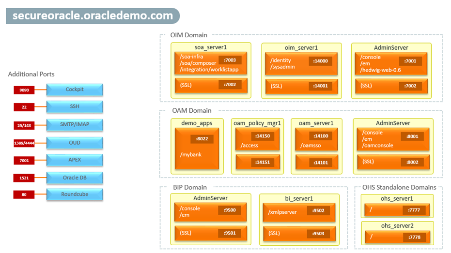
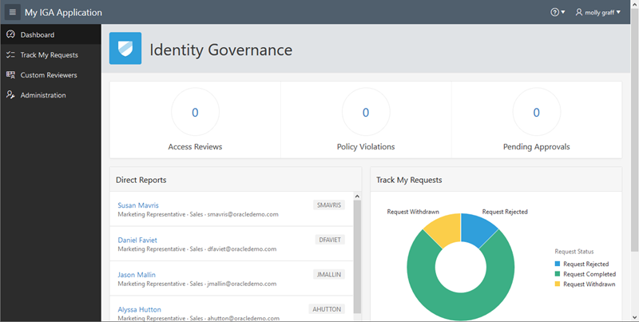

# Introduction

The lab exercises in the **SecureOracle 8.0** workshop walk you through some of the functionality to get started using the **Oracle IAM Suite 12c R2 PS4 (12.2.1.4.0)**. You will practice employee lifecycle management, identity certifications, RESTful APIs for identity governance, OAuth client and token management.

The Oracle IAM Suite provides a unified, integrated security platform designed to manage user lifecycle and provides secure access across enterprise resources, both within and beyond the firewall and into the cloud.

*Estimated Workshop Time*: 4 hours

### Objectives
At the end of this workshop, you will have a good understanding of:
- SecureOracle Demonstration Environment
- Employee Lifecycle Management
- Identity Certifications
- RESTful APIs for Identity Governance, OAuth Client and Token Management

### Prerequisites
The following is required to participate in this workshop:
- An Oracle Free Tier, Always Free, Paid or LiveLabs Cloud Account

## About SecureOracle 8.0?
SecureOracle 8.0 is a demonstration environment for the Oracle IAM Suite 12c R2 PS4 (12.2.1.4.0) which includes the following Oracle components:

- Identity Governance:
	- OIG 12c, SOA Suite 12c, BI Publisher 12c, OUD 12c, DB 19c and 12c Connectors
- Access Management:
	- OAM 12c, OHS/WebGate 12c, OUD 12c and DB 19c
- Development Tools and Assets:
	- [JDeveloper 12c with SOA Extensions](http://www.oracle.com/technetwork/middleware/soasuite/downloads/index.html)
	- [SQL Developer 19.2.1](https://www.oracle.com/database/technologies/appdev/sql-developer.html)
	- [Apache Studio 2](https://directory.apache.org/studio/)
	- [Oracle APEX 19.2](https://apex.oracle.com/en/)
	- Sample My HR and My IGA Applications and Demo Scenarios

**Note:** OIM and OIG are interchangeable terms and refer to the same product Oracle Identity Manager or Oracle Identity Governance.

SecureOracle can be used with Oracle Identity Cloud Service (IDCS) to showcase a hybrid identity management environment. When integrated with IDCS, the OIG component offers provisioning and governance services while IDCS provides access management services to cloud and on-prem applications.

The Oracle IAM Suite 12c R2 PS4 can be deployed using the Oracle IAM standard installation topology which is flexible and can be use as a starting point in production environments. The *Figure 1* depicts a standard WebLogic Server domain that contains an Administration Server and one or more clusters containing one or more Managed Servers.

   

*Figure 1*. Standard Topology for Oracle Identity and Access Management

The *Figure 2* depicts the domains that make up the SecureOracle environment. The OIG and OAM components can be started individually or all together, and with further configuration these can be integrated following the official documentation [integrating OIG and OAM](https://docs.oracle.com/en/middleware/idm/suite/12.2.1.4/integrate.html) available online.

   

*Figure 2*. SecureOracle - Demonstration Platform for IAM Suite 12c R2 PS4

By default all non-SSL ports are used to execute the different lab exercises, however you can enable SSL ports as needed to meet specific demo requirements. Please refer to the official product documentation for details on how to enable SSL.

### Lab Overview

- **Lab: Getting Started with SecureOracle 8.0** -
    In this lab we will review what is new in SecureOracle 8.0 demonstration platform and learn how to start the different components, run the development tools and access the different administration consoles and demo applications.

- **Lab: Employee Lifecycle Management** -
    In this lab we will exercise several use cases associated with employee on-boarding, user lifecycle, transfers, manager approvals and employee terminations using My HR Application as authoritative source in Oracle Identity Manager.

- **Lab: Identity Certification** -
    Identity certification is the process of reviewing user entitlements and access-privileges within an enterprise to ensure that users have not acquired entitlements that they are not authorized to have. It also involves either approving (certifying) or rejecting (revoking) each access-privilege. In this lab we will review user certification with custom reviewers.

- **Lab: RESTful OIM and OAM APIs** -
    In this lab we will review several use cases associated with invoking REST APIs for OIM Self Service, User Profile Updates, Request, Approvals and OAM OAuth Service.

## What is New in Version 8.0
Version 8.0 of SecureOracle include the following features:
* Fresh installation of Oracle IAM Suite 12c R2 PS4 (12.2.1.4.0)
* Oracle Access Management includes the following services:
	* Adaptive Authentication Service
	* OAuth and OpenIDConnect Service
	* Identity Federation
	* Access Portal Service
* By default the communication between OAM and WebGate is OAP over REST
* [HTTPie](https://httpie.org/) open source command line HTTP client to interact with RESTful APIs, Web Services and HTTP servers.
* Oracle Identity Governance includes the following 12c connectors:
	* Box, Concur, DB Applications Table, Oracle/MySQL DB User Management, Flat File, Google Apps, GoToMeeting, IDCS, Microsoft AD User Management, Office365, EBS Employee Reconciliation, EBS User Management, OID/ODSEE/OUD/LDAP, Salesforce, SAP Success Factor, SAP User Management, SAP User Management Engine, ServiceNow, Unix, WebEx
* [Cockpit](https://cockpit-project.org/) is an open source tool to manage servers using an easy to use web console. Cockpit comes pre-installed with SecureOracle and allows to start all components without having to use an SSH client.

  

  Figure 1. Cockpit Web Console

* Oracle Unified Directory include the following services:
	* REST APIs for accessing identity information and managing directory data
* Pre-configured connectors
	* 12c IDCS connector for integration with IDCS provisioning and governance
	* 12c ODSEE/OUD/LDAP connector for integration with OUD
	* 12c DBAT connector for integration with My HR Application
* Updated SecureOracle documentation including:
	* Getting Started Guide
	* Deploying SecureOracle in OCI
	* Deploying SecureOracle in VMware-VirtualBox
	* Employee Lifecycle Management
	* RESTful OIM and OAM APIs
	* OAM Hybrid Scenario
	* Identity Certifications
	* Android Emulator NoxPlayer Guide
* Open source email server and client to support demo use cases
	* Webmail client: [Roundcube 1.4.1](https://roundcube.net/ "Roundcube") with support for HTML content
	* Email server: [Hedwig Mail Server](http://hwmail.sourceforge.net/ "Hedwig") with simple web console for maintaining email accounts
* SecureOracle images are available for deployment on:
	* OCI Compute
	* VirtualBox or VMware
* Updated Demonstration Assets to APEX 19.2
	* My HR Application - developed entirely in APEX and running in the Oracle Database, help demonstrate HR employee life cycle management and integration with OIG. Full HTML5 interface supporting modern browsers.
	* My IGA Application - also developed in APEX aimed to showcase governance capabilities using OIG REST APIs and certifications like custom reviewers. Full HTML5 interface supporting modern browsers.

    

    Figure 2. My HR Application

    

    Figure 3. My IGA Application

* Support for hybrid use cases on integration with IDCS, including:
	* OIG 12c connector for provisioning with IDCS
	* OAM Webgate configured in cloud-mode for integration with IDCS

## Learn More
Use these links to get more information about Oracle Identity and Access Management:
- [Oracle Identity Management Website](https://docs.oracle.com/en/middleware/idm/suite/12.2.1.4/index.html)
- [Oracle Identity Governance Documentation](https://docs.oracle.com/en/middleware/idm/identity-governance/12.2.1.4/index.html)
- [Oracle Access Management Documentation](https://docs.oracle.com/en/middleware/idm/access-manager/12.2.1.4/books.html)

## Acknowledgements
- **Author** - Ricardo Gutierrez, Solution Engineering - Security and Management
- **Contributors** - Meghana Banka, Rene Fontcha
- **Last Updated By/Date** - Rene Fontcha, LiveLabs Platform Lead, NA Technology, November 2020
