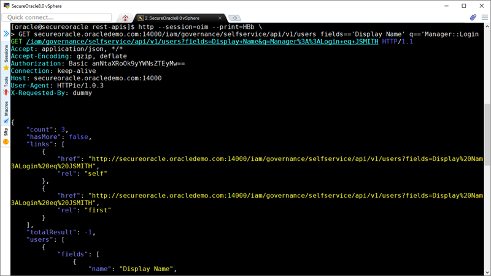

# Using RESTful APIs for OIM and OAM

## Introduction

In this lab we will review several use cases associated with invoking REST APIs for OIM Self Service, User Profile Updates, Request, Approvals and OAM OAuth Service.

The following use cases are available:

OIM REST APIs
- Get direct reports
- Get user properties
- Update user profile
- Approve request

OAM REST APIs
- Create OAuth identity domain
- Create OAuth resource
- Create OAuth client
- Create OAuth token
- Validate OAuth token
- Delete OAuth client, resource and domain

*Estimated Lab Time*:  60 minutes

### Objectives
- Become familiar with RESTful APIs for identity governance, OAuth client and token Management

### Prerequisites
This lab assumes you have:
- A Free Tier, Paid or LiveLabs Oracle Cloud account
- SSH Private Key to access the host via SSH
- You have completed:
    - Lab: Generate SSH Keys (*Free-tier* and *Paid Tenants* only)
    - Lab: Prepare Setup (*Free-tier* and *Paid Tenants* only)
    - Lab: Environment Setup
    - Lab: Initialize Environment

## Task 1: OIM Get Direct Reports
1.  From the terminal session as “*oracle*” user and run the following commands to obtain an OIM token for manager JSMITH and store it in the HTTPie session store.

    E.g. First change to the following folder:

    ```
    <copy>cd /home/oracle/demo/rest-apis</copy>
    ```

    Then, run the following HTTPie command:

    ```
    <copy>
    http --session=oim --print=HBb -a jsmith:Oracle123 \
    POST secureoracle.oracledemo.com:14000/iam/governance/token/api/v1/tokens \
    X-Requested-By:dummy Content-Type:application/json
    </copy>
    ```

    **Note:** In the previous command the **session** parameter instructs HTTPie to store the access token internally for future use.

2. Proceed to obtain the direct reports for manager JSMITH.

    E.g. Run the following HTTPie command:

    ```
    <copy>
    http --session=oim --print=HBb \
    GET secureoracle.oracledemo.com:14000/iam/governance/selfservice/api/v1/users \ fields=='Display Name' q=='Manager::Login eq JSMITH'
    </copy>
    ```

    **Note**: Since we have already stored the access token we don't need to specify the user credentials and HTTPie is able to successful invoke the API as shown in Figure 1.

	

    Figure 1. Get Direct Reports API

3. The result from the previous command will contain in JSON format the direct report names of manager **JSMITH**.

    E.g. Response for direct reports of manager **JSMITH**:

    ```
    {
  	    "count": 3,
  	    "hasMore": false,
  	    "links": [
  	        {
  	            "href": "http://secureoracle.oracledemo.com:14000/iam/governance/selfservice/api/v1/users?fields=Display%20Nam3ALogin%20eq%20JSMITH",
  	            "rel": "self"
  	        },
  	        {
  	            "href": "http://secureoracle.oracledemo.com:14000/iam/governance/selfservice/api/v1/users?fields=Display%20Nam3ALogin%20eq%20JSMITH",
  	            "rel": "first"
  	        }
  	    ],
  	    "totalResult": -1,
  	    "users": [
  	        {
  	            "fields": [
  	                {
  	                    "name": "Display Name",
  	                    "value": "Peter Car"
  	                },
  	                {
  	                    "name": "usr_key",
  	                    "value": 6003
  	                }
  	            ],
  	            "id": "6003",
  	            "links": [
  	                {
  	                    "href": "http://secureoracle.oracledemo.com:14000/iam/governance/selfservice/api/v1/users/6003",
  	                    "rel": "self"
  	                }
  	            ]
  	        },
  	        {
  	            "fields": [
  	                {
  	                    "name": "Display Name",
  	                    "value": "Paul Song"
  	                },
  	                {
  	                    "name": "usr_key",
  	                    "value": 6004
  	                }
  	            ],
  	            "id": "6004",
  	            "links": [
  	                {
  	                    "href": "http://secureoracle.oracledemo.com:14000/iam/governance/selfservice/api/v1/users/6004",
  	                    "rel": "self"
  	                }
  	            ]
  	        },
  	        {
  	            "fields": [
  	                {
  	                    "name": "Display Name",
  	                    "value": "Emily Clark"
  	                },
  	                {
  	                    "name": "usr_key",
  	                    "value": 3004
  	                }
  	            ],
  	            "id": "3004",
  	            "links": [
  	                {
  	                    "href": "http://secureoracle.oracledemo.com:14000/iam/governance/selfservice/api/v1/users/3004",
  	                    "rel": "self"
  	                }
  	            ]
  	        }
  	    ]
  	}
    ```

## Task 2: OIM Get User Properties
1. Login as “*oracle*” user and run the following commands to obtain an OIM token for manager MGRAFF and store it in the HTTPie session store.

    E.g. First change to the following folder:

    ```
    <copy>cd /home/oracle/demo/rest-apis</copy>
    ```

    Then, run the following HTTPie command:

    ```
    <copy>
    http --session=oim --print=HBb -a mgraff:Oracle123 \
    POST secureoracle.oracledemo.com:14000/iam/governance/token/api/v1/tokens \
    X-Requested-By:dummy Content-Type:application/json
    </copy>
    ```

    **Note:** in the previous command the **session** parameter instructs HTTPie to store the access token internally for future use.

2. Proceed to obtain the user profile properties of manager **MGRAFF**.

    E.g. Run the following HTTPie command:

    ```
    <copy>
    http --session=oim --print=HBb \
    GET secureoracle.oracledemo.com:14000/iam/governance/selfservice/api/v1/users \
    fields=='Display Name,Title,Organization Name,User Login,Role,Email' \
    q=='User::Login eq MGRAFF'
    </copy>
    ```

    **Note**: Since we have already stored the access token we don't need to specify the user credentials.

3. The result from the previous command will contain in JSON format the user profile properties of manager **MGRAFF**.

    E.g. Response containing user profile properties of manager **MGRAFF**:

    ```
    {
  	    "count": 1,
  	    "hasMore": false,
  	    "links": [
  	        {
  	            "href": "http://secureoracle.oracledemo.com:14000/iam/governance/selfservice/api/v1/users?fields=Display%20Name%2CTitle%2COrganization%20Name%2CUser%20Login%2CRole%2CEmail&offset=1&limit=10&q=User%3A%3ALogin%20eq%20MGRAFF",
  	            "rel": "self"
  	        },
  	        {
  	            "href": "http://secureoracle.oracledemo.com:14000/iam/governance/selfservice/api/v1/users?fields=Display%20Name%2CTitle%2COrganization%20Name%2CUser%20Login%2CRole%2CEmail&offset=1&limit=10&q=User%3A%3ALogin%20eq%20MGRAFF",
  	            "rel": "first"
  	        }
  	    ],
  	    "totalResult": -1,
  	    "users": [
  	        {
  	            "fields": [
  	                {
  	                    "name": "Display Name",
  	                    "value": "Molly Graff"
  	                },
  	                {
  	                    "name": "Role",
  	                    "value": "Full-Time"
  	                },
  	                {
  	                    "name": "Organization Name",
  	                    "value": "Sales"
  	                },
  	                {
  	                    "name": "Email",
  	                    "value": "mgraff@oracledemo.com"
  	                },
  	                {
  	                    "name": "Title",
  	                    "value": "Sales Manager"
  	                },
  	                {
  	                    "name": "usr_key",
  	                    "value": 5001
  	                },
  	                {
  	                    "name": "User Login",
  	                    "value": "MGRAFF"
  	                }
  	            ],
  	            "id": "5001",
  	            "links": [
  	                {
  	                    "href": "http://secureoracle.oracledemo.com:14000/iam/governance/selfservice/api/v1/users/5001",
  	                    "rel": "self"
  	                }
  	            ]
  	        }
  	    ]
  	}
    ```

4. As manager **MGRAFF** also has permissions to obtain the user properties of her direct reports.

    E.g. Run the following HTTPie command to obtain the user properties of direct report **JMALLIN**:

    ```
    <copy>
    http --session=oim --print=HBb \
    GET secureoracle.oracledemo.com:14000/iam/governance/selfservice/api/v1/users \
    fields=='Display Name,Title,Organization Name,User Login,Role,Email' \
    q=='User::Login eq JMALLIN'
    </copy>
    ```

5. The result from the previous command will contain in JSON format the user profile properties of direct report **JMALLIN**.

    E.g. Response containing user profile properties of direct report **JMALLIN**:

    ```
    {
  	    "count": 1,
  	    "hasMore": false,
  	    "links": [
  	        {
  	            "href": "http://secureoracle.oracledemo.com:14000/iam/governance/selfservice/api/v1/users?fields=Display%20Name%2CTitle%2COrganization%20Name%2CUser%20Login%2CRole%2CEmail&offset=1&limit=10&q=User%3A%3ALogin%20eq%20JMALLIN",
  	            "rel": "self"
  	        },
  	        {
  	            "href": "http://secureoracle.oracledemo.com:14000/iam/governance/selfservice/api/v1/users?fields=Display%20Name%2CTitle%2COrganization%20Name%2CUser%20Login%2CRole%2CEmail&offset=1&limit=10&q=User%3A%3ALogin%20eq%20JMALLIN",
  	            "rel": "first"
  	        }
  	    ],
  	    "totalResult": -1,
  	    "users": [
  	        {
  	            "fields": [
  	                {
  	                    "name": "Display Name",
  	                    "value": "Jason Mallin"
  	                },
  	                {
  	                    "name": "Role",
  	                    "value": "Full-Time"
  	                },
  	                {
  	                    "name": "Organization Name",
  	                    "value": "Sales"
  	                },
  	                {
  	                    "name": "Email",
  	                    "value": "jmallin@oracledemo.com"
  	                },
  	                {
  	                    "name": "Title",
  	                    "value": "Marketing Representative"
  	                },
  	                {
  	                    "name": "usr_key",
  	                    "value": 6007
  	                },
  	                {
  	                    "name": "User Login",
  	                    "value": "JMALLIN"
  	                }
  	            ],
  	            "id": "6007",
  	            "links": [
  	                {
  	                    "href": "http://secureoracle.oracledemo.com:14000/iam/governance/selfservice/api/v1/users/6007",
  	                    "rel": "self"
  	                }
  	            ]
  	        }
  	    ]
  	}
    ```

## Task 3: OIM Update User Profile
1. Login as “*oracle*” user and run the following commands to obtain an OIM token for manager MGRAFF and store it in the HTTPie session store.

    E.g. First change to the following folder:

    ```
    <copy>cd /home/oracle/demo/rest-apis</copy>
    ```

    Then, run the following HTTPie command:

    ```
    <copy>
    http --session=oim --print=HBb -a mgraff:Oracle123 \
    POST secureoracle.oracledemo.com:14000/iam/governance/token/api/v1/tokens \
    X-Requested-By:dummy Content-Type:application/json
    </copy>
    ```

    **Note:** In the previous command the **session** parameter instructs HTTPie to store the access token internally for future use.

2. Proceed to submit a request to update **MGRAFF** user profile.

    E.g. Run the following HTTPie command:

    ```
    <copy>
    http --session=oim --print=HBb \
    PUT secureoracle.oracledemo.com:14000/iam/governance/selfservice/api/v1/users < usr_changes.json
    </copy>
    ```

    **Note**: In the previous command an input file **`usr_changes.json`** is provided to the HTTPie command which include the user id and property to be updated. Feel free to review the content of the file in `/home/oracle/demo/rest-apis/usr_changes.json`

    The response should be similar to the following content:

    ```
    {
  	    "users": [
  	        {
  	            "fields": [
  	                {
  	                    "name": "Title",
  	                    "value": "Sales Manager Applications"
  	                }
  	            ],
  	            "id": "5001"
  	        }
  	    ]
  	}

  	{
  	    "users": [
  	        {
  	            "fields": [
  	                {
  	                    "name": "Title",
  	                    "value": "Sales Manager Applications"
  	                }
  	            ],
  	            "links": [
  	                {
  	                    "href": "http://secureoracle.oracledemo.com:14000/iam/governance/selfservice/api/v1/users/5001",
  	                    "rel": "self"
  	                }
  	            ],
  	            "request": {
  	                "id": "5004",
  	                "links": [
  	                    {
  	                        "href": "http://secureoracle.oracledemo.com:14000/iam/governance/selfservice/api/v1/requests/5004",
  	                        "rel": "self"
  	                    }
  	                ]
  	            },
  	            "status": "SUCCESS"
  	        }
  	    ]
  	}
    ```

3. Now that the request has been submitted you can keep track of the request by invoking another API to show the status of the request.

    E.g. Run the following HTTPie command:

    ```
    <copy>
    http --session=oim --print=HBb \
    GET secureoracle.oracledemo.com:14000/iam/governance/selfservice/api/v1/requests view=='trackRequests' \
    q=='reqStatus eq Request::Awaiting::Approval'
    </copy>
    ```

    The response should be similar to the following content, under the **request** section, notice the **id** and **reqStatus** properties.

    ```
    {
  	    "count": 1,
  	    "hasMore": false,
  	    "links": [
  	        {
  	            "href": "http://secureoracle.oracledemo.com:14000/iam/governance/selfservice/api/v1/requests?view=trackRequests&offset=1&limit=10&q=reqStatus%20eq%20Request%3A%3AAwaiting%3A%3AApproval",
  	            "rel": "self"
  	        },
  	        {
  	            "href": "http://secureoracle.oracledemo.com:14000/iam/governance/selfservice/api/v1/requests?view=trackRequests&offset=1&limit=10&q=reqStatus%20eq%20Request%3A%3AAwaiting%3A%3AApproval",
  	            "rel": "first"
  	        }
  	    ],
  	    "requests": [
  	        {
  	            "id": "5004",
  	            "links": [
  	                {
  	                    "href": "http://secureoracle.oracledemo.com:14000/iam/governance/selfservice/api/v1/requests/5004",
  	                    "rel": "self"
  	                }
  	            ],
  	            "reqBeneficiaryList": [
  	                {
  	                    "id": "5001",
  	                    "links": [
  	                        {
  	                            "href": "http://secureoracle.oracledemo.com:14000/iam/governance/selfservice/api/v1/users/5001",
  	                            "rel": "self"
  	                        }
  	                    ]
  	                }
  	            ],
  	            "reqCreatedOn": "2020-02-03T20:44:36Z",
  	            "reqStatus": "Request Awaiting Approval",
  	            "reqType": "Modify User Profile",
  	            "requester": {
  	                "link": {
  	                    "href": "http://secureoracle.oracledemo.com:14000/iam/governance/selfservice/api/v1/users/5001",
  	                    "rel": "self"
  	                },
  	                "name": "requesterId",
  	                "value": "5001"
  	            }
  	        }
  	    ],
  	    "totalResult": -1
  	}
    ```

## Task 4: OIM Approve Request
1. Login as “*oracle*” user and run the following commands to obtain an OIM token for **XELSYSADM** as by default only administrators or approvers can see the request's assignee and approve requests.

    E.g. First change to the following folder:

    ```
    <copy>cd /home/oracle/demo/rest-apis</copy>
    ```

    Then, run the following HTTPie command:

    ```
    <copy>
    http --session=oim --print=HBb -a xelsysadm:Oracle123 \
    POST secureoracle.oracledemo.com:14000/iam/governance/token/api/v1/tokens \
    X-Requested-By:dummy Content-Type:application/json
    </copy>
    ```

    **Note:** in the previous command the **session** parameter instructs HTTPie to store the access token internally for future use.

2. Proceed to check for requests pending for approval.

    E.g. Run the following HTTPie command:

    ```
    <copy>
    http --session=oim --print=HBb \
    GET secureoracle.oracledemo.com:14000/iam/governance/selfservice/api/v1/requests view=='pendingApprovals'
    </copy>
    ```

    **Note**: the previous command will return the requests pending for approval as well as the assignees who can approve the request.

    The response should be similar to the following content:

    ```
    {
  	    "count": 1,
  	    "hasMore": false,
  	    "links": [
  	        {
  	            "href": "http://secureoracle.oracledemo.com:14000/iam/governance/selfservice/api/v1/requests?view=pendingApprovals&offset=1&limit=10",
  	            "rel": "self"
  	        },
  	        {
  	            "href": "http://secureoracle.oracledemo.com:14000/iam/governance/selfservice/api/v1/requests?view=pendingApprovals&offset=1&limit=10",
  	            "rel": "first"
  	        }
  	    ],
  	    "requests": [
  	        {
  	            "assignee": "SYSTEM ADMINISTRATORS",
  	            "created": "2020-02-03T20:44:37Z",
  	            "creator": "mgraff",
  	            "id": "5004",
  	            "links": [
  	                {
  	                    "href": "http://secureoracle.oracledemo.com:14000/iam/governance/selfservice/api/v1/requests/5004",
  	                    "rel": "self"
  	                }
  	            ],
  	            "state": "ASSIGNED",
  	            "status": "Request Awaiting Approval",
  	            "taskId": "13076f03-e1c7-46da-a58d-59c283fd9b13",
  	            "title": "Default operational level approval for Request ID 5004"
  	        }
  	    ],
  	    "totalResult": -1
  	}
    ```

3. Before you can approve the request, you should create a file containing the request id and approve action. The file has been created already and you just need to update the request id, do so by editing file **`usr_approve.json`**.

    E.g. Edit file **`/home/oracle/demo/rest-apis/usr_approve.json`** and update the **id** value as follow:

    ```
    {
        "requests": [
            {
                "id": "5004",
                "actionComment": "REST sysadmin approved",
                "action": "approve"
            }
        ]
    }
    ```

    **Note**: the **id** value has been updated with the value of the request id returned by the previous HTTPie command.

4. Proceed to approve the request pending for approval.

    E.g. Run the following HTTPie command:

    ```
    <copy>
    http --session=oim --print=HBb \
    PUT secureoracle.oracledemo.com:14000/iam/governance/selfservice/api/v1/requests < usr_approve.json
    </copy>
    ```

    **Note**: in the previous command an input file **`usr_approve.json`** is provided to the HTTPie command which includes the request id and approve action.

    The response should be similar to the following content:

    ```
    {
  	    "requests": [
  	        {
  	            "action": "approve",
  	            "actionComment": "REST sysadmin approved",
  	            "id": "5004"
  	        }
  	    ]
  	}

  	{
  	    "links": [
  	        {
  	            "href": "http://secureoracle.oracledemo.com:14000/iam/governance/selfservice/api/v1/requests",
  	            "rel": "self"
  	        }
  	    ],
  	    "requests": [
  	        {
  	            "id": "5004",
  	            "links": [
  	                {
  	                    "href": "http://secureoracle.oracledemo.com:14000/iam/governance/selfservice/api/v1/requests/5004",
  	                    "rel": "self"
  	                }
  	            ],
  	            "status": "SUCCESS"
  	        }
  	    ]
  	}
    ```

5. Finally, we can validate if the changes were effective by checking the properties for user **MGRAFF**.

    E.g. Run the following HTTPie command:

    ```
    <copy>
    http --session=oim --print=HBb \
    GET secureoracle.oracledemo.com:14000/iam/governance/selfservice/api/v1/users fields=='Display Name,Title' \
    q=='User::Login eq MGRAFF'
    </copy>

    ```
    The response should be similar to the following content:

    ```
    {
  	    "count": 1,
  	    "hasMore": false,
  	    "links": [
  	        {
  	            "href": "http://secureoracle.oracledemo.com:14000/iam/governance/selfservice/api/v1/users?fields=Display%20Name%2CTitle&offset=1&limit=10&q=User%3A%3ALogin%20eq%20MGRAFF",
  	            "rel": "self"
  	        },
  	        {
  	            "href": "http://secureoracle.oracledemo.com:14000/iam/governance/selfservice/api/v1/users?fields=Display%20Name%2CTitle&offset=1&limit=10&q=User%3A%3ALogin%20eq%20MGRAFF",
  	            "rel": "first"
  	        }
  	    ],
  	    "totalResult": -1,
  	    "users": [
  	        {
  	            "fields": [
  	                {
  	                    "name": "Display Name",
  	                    "value": "Molly Graff"
  	                },
  	                {
  	                    "name": "Title",
  	                    "value": "Sales Manager Applications"
  	                },
  	                {
  	                    "name": "usr_key",
  	                    "value": 5001
  	                }
  	            ],
  	            "id": "5001",
  	            "links": [
  	                {
  	                    "href": "http://secureoracle.oracledemo.com:14000/iam/governance/selfservice/api/v1/users/5001",
  	                    "rel": "self"
  	                }
  	            ]
  	        }
  	    ]
  	}
    ```

## Task 5: OAM Create OAuth Identity Domain
1. Login as “*oracle*” user and invoke the OAM REST API to create an OAuth identity domain.

    E.g. First change to the following folder:

    ```
    <copy>cd /home/oracle/demo/rest-apis</copy>
    ```

    Then, run the following HTTPie command:

    ```
    <copy>
    http --print=HBb -a oamadmin:Oracle123 \
    POST http://secureoracle.oracledemo.com:8001/oam/services/rest/ssa/api/v1/oauthpolicyadmin/oauthidentitydomain < oam_oauth_domain.json
    </copy>
    ```

    **Note**: In the previous command file **`oam_oauth_domain.json`** contains sample parameters to define an identity domain. Feel free to review the content of the file in **`/home/oracle/demo/rest-apis/oam_oauth_domain.json`**.

    The response should be similar to the following content:

    ```
    {
  	    "consentPageURL": "http://secureoracle.oracledemo.com:8001/oam/pages/consent.jsp",
  	    "customAttrs": "{\"keyAttributeName\":\"title\"}",
  	    "description": "Secret Key Test Domain",
  	    "errorPageURL": "http://secureoracle.oracledemo.com:8001/oam/pages/error.jsp",
  	    "identityProvider": "LDAPIDStore",
  	    "name": "DefaultDomain",
  	    "tokenSettings": [
  	        {
  	            "lifeCycleEnabled": false,
  	            "refreshTokenEnabled": false,
  	            "refreshTokenExpiry": 0,
  	            "refreshTokenLifeCycleEnabled": false,
  	            "tokenExpiry": 0,
  	            "tokenType": "ACCESS_TOKEN"
  	        },
  	        {
  	            "lifeCycleEnabled": false,
  	            "refreshTokenEnabled": false,
  	            "refreshTokenExpiry": 3600,
  	            "refreshTokenLifeCycleEnabled": true,
  	            "tokenExpiry": 0,
  	            "tokenType": "AUTHZ_CODE"
  	        }
  	    ]
  	}
    ```

## Task 6: OAM Create OAuth Resource
1. Login as “*oracle*” user and invoke the OAM REST API to create an OAuth resource.

    E.g. First change to the following folder:

    ```
    <copy>cd /home/oracle/demo/rest-apis</copy>
    ```

    Then, run the following HTTPie command:

    ```
    <copy>
    http --print=HBb -a oamadmin:Oracle123 \
    POST http://secureoracle.oracledemo.com:8001/oam/services/rest/ssa/api/v1/oauthpolicyadmin/application < oam_oauth_resource.json
    </copy>
    ```

    **Note**: In the previous command file **`oam_oauth_resource.json`** contains sample parameters to define an OAuth resource. Feel free to review the content of the file in **`/home/oracle/demo/rest-apis/oam_oauth_resource.json`**.

    The response should be similar to the following content:

    ```
    {
  	    "description": "Secret Key Test Resource",
  	    "idDomain": "DefaultDomain",
  	    "name": "DefaultResource",
  	    "scopes": [
  	        {
  	            "description": "ViewPage",
  	            "scopeName": "scope1"
  	        },
  	        {
  	            "description": "UpdatePage",
  	            "scopeName": "scope2"
  	        },
  	        {
  	            "description": "ModifyPage",
  	            "scopeName": "scope3"
  	        }
  	    ],
  	    "tokenAttributes": [
  	        {
  	            "attrName": "sessionId",
  	            "attrType": "DYNAMIC",
  	            "attrValue": "$session.id"
  	        },
  	        {
  	            "attrName": "resSrvAttr",
  	            "attrType": "STATIC",
  	            "attrValue": "RESOURCECONST"
  	        }
  	    ]
  	}
    ```

## Task 7: OAM Create OAuth Client
1. Login as “*oracle*” user and invoke the OAM REST API to create an OAuth client.

    E.g. First change to the following folder:

    ```
    <copy>cd /home/oracle/demo/rest-apis</copy>
    ```

    Then, run the following HTTPie command:

    ```
    <copy>
    http --print=HBb -a oamadmin:Oracle123 \
    POST http://secureoracle.oracledemo.com:8001/oam/services/rest/ssa/api/v1/oauthpolicyadmin/client < oam_oauth_client.json
    </copy>
    ```

    **Note 1**: In the previous command file **`oam_oauth_client.json`** contains sample parameters to define an OAuth client. Feel free to review the content of the file in **`/home/oracle/demo/rest-apis/oam_oauth_client.json`**.

    **Note 2**: Only the first time the API is invoked to create a new client, the **Client ID** and **Secret** values are returned in the response in clear text. Further queries to review the client definition will return the Secret value masked.

    The response should be similar to the following content:

    ```
    {
  	    "clientType": "CONFIDENTIAL_CLIENT",
  	    "defaultScope": "DefaultResource.scope1",
  	    "description": "Secret Key Test Client",
  	    "grantTypes": [
  	        "PASSWORD",
  	        "CLIENT_CREDENTIALS",
  	        "JWT_BEARER",
  	        "REFRESH_TOKEN",
  	        "AUTHORIZATION_CODE"
  	    ],
  	    "idDomain": "DefaultDomain",
  	    "name": "DefaultClient",
  	    "redirectURIs": [
  	        {
  	            "isHttps": false,
  	            "url": "http://localhost:8080/Sample.jsp"
  	        }
  	    ],
  	    "scopes": [
  	        "DefaultResource.scope1"
  	    ]
  	}

  	Sucessfully created entity - OAuthClient, detail - OAuth Client - \
  	uid = 46194a6a-4340-4f6b-8a8a-b72244c84655, name = DefaultClient, \
  	id = aac8a8f4a228448d9d69ac24a3def39a, identityDomain = DefaultDomain, \
  	description = Secret Key Test Client, secret = 2a56c4b436f642da949047417858ce02,\
  	clientType = CONFIDENTIAL_CLIENT, \
  	grantTypes = [PASSWORD, CLIENT_CREDENTIALS, JWT_BEARER, REFRESH_TOKEN, AUTHORIZATION_CODE], \
  	attributes = [{"attrName":"sessionId","attrValue":"$session.id","attrType":DYNAMIC},\
  	{"attrName":"resSrvAttr","attrValue":"RESOURCECONST","attrType":STATIC}], \
  	scopes = [DefaultResource.scope1], defaultScope = DefaultResource.scope1, \
  	redirectURIs = [{"url":"http://localhost:8080/Sample.jsp","isHttps":true}]
    ```

## Task 8: OAM Create OAuth Token
1. Login as “*oracle*” user and invoke the OAM REST API to create an OAuth access token.

    E.g. First change to the following folder:

    ```
    <copy>cd /home/oracle/demo/rest-apis</copy>
    ```

    Then, run the following command to generate the authorization string encode in Base64 using the **Client ID** and **Secret** values from the previous step:

    ```
    <copy>echo -n <client_id>:<secret> | base64 -w 0</copy>
    ```

    Use the authorization string to invoke the REST API as follow:

    ```
    <copy>
    http --print=HBb -f POST http://secureoracle.oracledemo.com:14100/oauth2/rest/token \
    'Authorization:Basic <auth_string>' \
    X-OAUTH-IDENTITY-DOMAIN-NAME:DefaultDomain \
    grant_type=PASSWORD username=oamadmin password=Oracle123
    </copy>
    ```

    **Note**: replace **`auth_string`** with the generated authorization string encoded in Base64.

    The response should be similar to the following content:

    ```
    {
        "access_token": "eyJraWQiOiJEZWZhdWx0RG9tYWluIiwieDV0...lXXO7AWYlusA",
        "expires_in": 0,
        "token_type": "Bearer"
    }
    ```

## Task 9: OAM Validate OAuth Token
1. Login as “*oracle*” user and invoke the OAM REST API to validate the OAuth access token.

    E.g. First change to the following folder:

    ```
    <copy>cd /home/oracle/demo/rest-apis</copy>
    ```

    Then, run the following HTTPie command:

    ```
    <copy>
    http --print=HBb GET http://secureoracle.oracledemo.com:14100/oauth2/rest/token/info \
    access_token==<access_token> \
    X-OAUTH-IDENTITY-DOMAIN-NAME:DefaultDomain
    </copy>
    ```

    **Note**: replace **`access_token`** with the access token obtained in the previous step.

    The response should be similar to the following content:

    ```
    {
  	    "aud": "DefaultResource",
  	    "client": "aac8a8f4a228448d9d69ac24a3def39a",
  	    "domain": "DefaultDomain",
  	    "exp": 1580863937,
  	    "iat": 1580860337,
  	    "iss": "http://secureoracle.oracledemo.com:14100/oauth2",
  	    "jti": "qOlgoKdRD3Cl6hUwZwhDzw",
  	    "rem_exp": 3438,
  	    "resSrvAttr": "RESOURCECONST",
  	    "scope": [
  	        "DefaultResource.scope1"
  	    ],
  	    "sessionId": "COOKIE_BASED",
  	    "sub": "oamadmin"
  	}
    ```

## Task 10: OAM Delete OAuth Client, Resource and Domain
1. Login as “*oracle*” user and invoke the OAM REST APIs to delete the OAuth client, resource and identity domain.

    E.g. First change to the following folder:

    ```
    <copy>cd /home/oracle/demo/rest-apis</copy>
    ```

    Then, run the following HTTPie command to delete the client:

    ```
    <copy>
    http --print=HBb -a oamadmin:Oracle123 \
    DELETE http://secureoracle.oracledemo.com:8001/oam/services/rest/ssa/api/v1/oauthpolicyadmin/client \
    identityDomainName=='DefaultDomain' name=='DefaultClient'
    </copy>
    ```

    Run the following HTTPie command to delete the resource:

    ```
    <copy>
    http --print=HBb -a oamadmin:Oracle123 \
    DELETE http://secureoracle.oracledemo.com:8001/oam/services/rest/ssa/api/v1/oauthpolicyadmin/application \
    identityDomainName=='DefaultDomain' name=='DefaultResource'
    </copy>
    ```

    Run the following HTTPie command to delete the identity domain:

    ```
    <copy>
    http --print=HBb -a oamadmin:Oracle123 \
    DELETE http://secureoracle.oracledemo.com:8001/oam/services/rest/ssa/api/v1/oauthpolicyadmin/oauthidentitydomain \
    name=='DefaultDomain'
    </copy>
    ```

    In all cases, the responses should be similar to the following content:

    ```
    Sucessfully deleted entity - OAuthClient, detail - DefaultClient

    Sucessfully deleted entity - OAuthResourceServer, detail - DefaultResource

    Sucessfully deleted entity - OAuthIdentityDomain, detail - DefaultDomain
    ```

## Learn More
Use these links to get more information about Oracle Identity and Access Management:
- [Oracle Identity Management Website](https://docs.oracle.com/en/middleware/idm/suite/12.2.1.4/index.html)
- [Oracle Identity Governance Documentation](https://docs.oracle.com/en/middleware/idm/identity-governance/12.2.1.4/index.html)
- [Oracle Access Management Documentation](https://docs.oracle.com/en/middleware/idm/access-manager/12.2.1.4/books.html)

## Acknowledgements
- **Author** - Ricardo Gutierrez, Solution Engineering - Security and Management
- **Contributors** - Rene Fontcha
- **Last Updated By/Date** - Sahaana Manavalan, LiveLabs Developer, NA Technology, March 2022