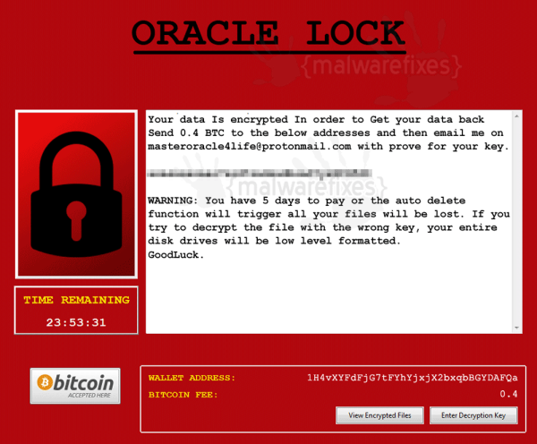

# Introduction

## About this Workshop
This workshop is a hands-on lab dedicated to the features and functionality of Oracle Database security to prevent, detect and mitigate the most common cyberattacks performed on Oracle Databases - for more details on each of the featured products, please refer to the Livelabs [DB Security Basics](https://apexapps.oracle.com/pls/apex/dbpm/r/livelabs/view-workshop?wid=698) and [DB Security Advanced](https://apexapps.oracle.com/pls/apex/dbpm/r/livelabs/view-workshop?wid=726) labs.

Based on an OCI architecture, deployed in a few minutes with a simple internet connection, this lab allows you to test database security use cases in an environment pre-configured by the Oracle Database Security Product Manager Team.

This lab helps you learn to use some of the most important security features of the Oracle Database.

*Estimated Workshop Time*: 40 minutes

### Objectives
During this workshop, you will perform different scenario:
- **as an attacker** - your main objective will be to exfiltrate sensitive data from a target database before encrypting data in a simulated ransomware attack
- **as a defender** - your main objective will be to prevent, detect and mitigate these attacks

In order to make this possible, we provide you with the necessary infrastructure components so that you can test the most common attacks exploited on a database by hackers.

As all these components are stored in the workshop's DBSec-Lab VM, you can conduct your attack without any risk and without fear of breaking anything.

So that your experience of this workshop is the best possible, DO NOT FORGET to perform "Lab: *Initialize Environment*" to be sure that all these resources are correctly set up!

The entire Database Security team wishes you an excellent workshop!

You may now [proceed to the next lab](#next).

## Acknowledgements
- **Author** - Hakim Loumi, Database Security Senior Principal PM
- **Contributors** - Russ Lowenthal
- **Last Updated By/Date** - Hakim Loumi - June 2022
